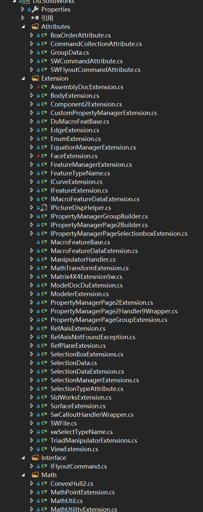

<div align=center></div>


# Overview

[English](https://github.com/weianweigan/DuSolidWorksExtension) | 中文

包含很多有用的SolidWorks Interface的扩展方法.

基于 https://github.com/Weingartner/SolidworksAddinFramework,
这个库的作者创建了一个很好的SolidWorks的开发架构,但由于无法编译和复杂,所有我修改重写后形成了此库.


## 安装

使用Nuget包管理器安装

```
PM> Install-Package Du.SolidWorks -Version 0.1.1
```

## 使用

### 1. 添加命名空间

```
using Du.SolidWorks.Extension;
using Du.SolidWorks.Math
```

### 2. 接下来你就能使用绝大多数扩展方法了

* 方程式管理器的扩展方法

 


```csharp
var doc = _addin.SwApp.ActiveDoc as ModelDoc2;

var equ = doc.GetEquationMgr().GetAllEqu().
          Where(p => p.GlobalVariable).Select(p => p.VarName);
```

----------------------------------------------------------------------------
----------------------------------------------------------------------------

* 自定义属性的扩展方法


```csharp
var doc = _addin.SwApp.ActiveDoc as ModelDoc2;

var dateProerty = doc.Extension.CustomPropertyManager[""].GetAllProperty()
                ?.Where(p => p.Value.Contains("日期"))?.Select(p => p.Name);
```

## 文档 

* 文档正在编写中

* [查看自动生成的文档](https://weianweigan.github.io/DuSolidWorksExtension/)

  --Du.SolidWorks.Extension (多数扩展方法在此命名空间下)

* 已经有的介绍文档如下

    1.[向量计算(为SolidWorks写扩展方法)](https://www.jianshu.com/p/ba0eb8869d31)

    2.[Linq查询](https://www.jianshu.com/p/350b7739ab79)

* 被扩展的接口列表如下



## 联系我

